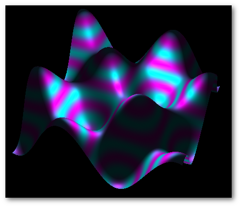

OpenGL CMake Skeleton :
=======================

A ready to use C++11 CMake skeleton using GLFW, Glew and glm.
Shader and Application class are included too.

git submodules :
================

This project use git submodules system.
To clone this repository you must add the --recursive option.
* git clone git@github.com:ArthurSonzogni/OpenGL_CMake_Skeleton.git **--recursive**

Requirement:
============
* C++11 compiler
* cmake (>= 2.8)
* OpenGL drivers (>=3.0)

usage (Linux) : 
---------------

Open the directory into a terminal
* mkdir build
* cd build
* cmake ..
* make run

usage (Windows) :
-----------------
(instructions are coming soon)

usage (Mac Os X) :
------------------
(instructions are coming soon)
